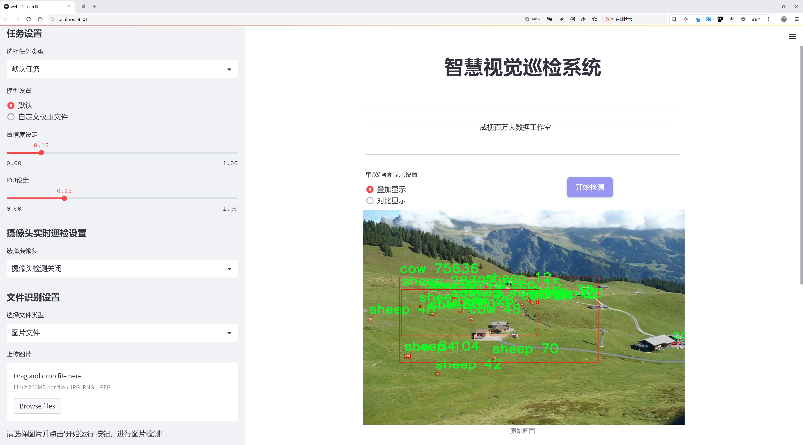
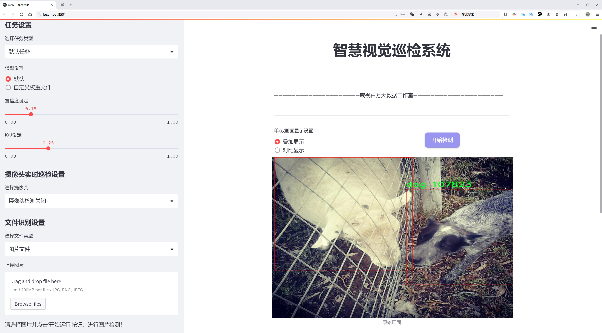
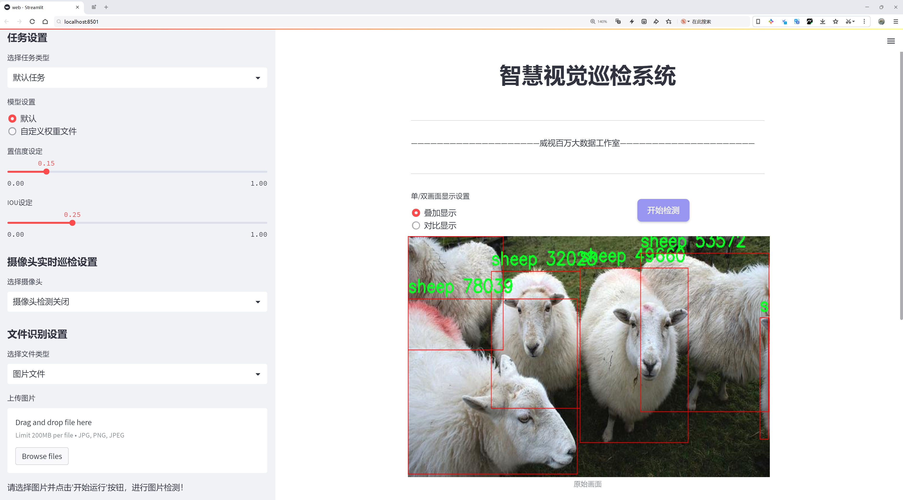
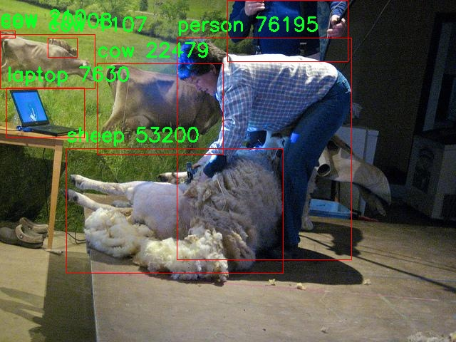
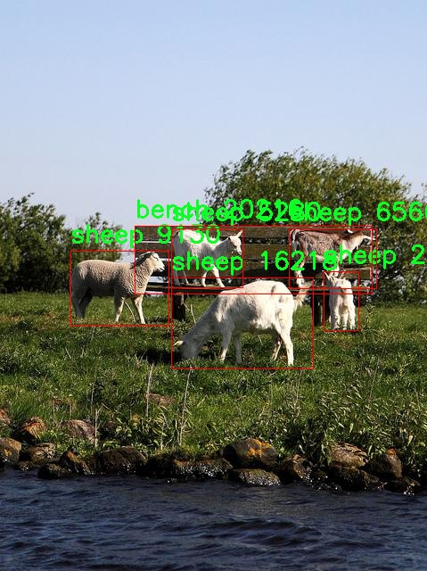
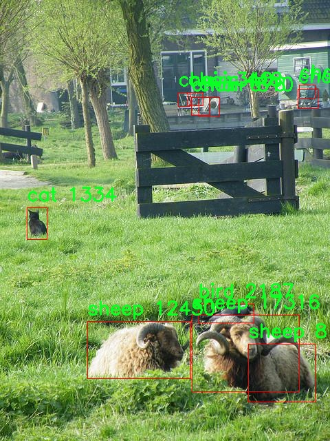
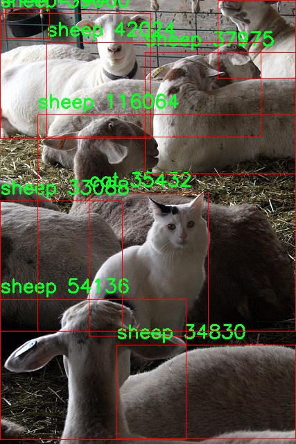
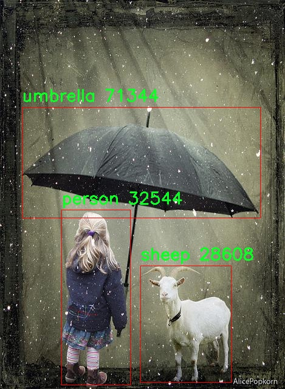

# 多类别物体检测检测系统源码分享
 # [一条龙教学YOLOV8标注好的数据集一键训练_70+全套改进创新点发刊_Web前端展示]

### 1.研究背景与意义

项目参考[AAAI Association for the Advancement of Artificial Intelligence](https://gitee.com/qunmasj/projects)

项目来源[AACV Association for the Advancement of Computer Vision](https://kdocs.cn/l/cszuIiCKVNis)

研究背景与意义

随着计算机视觉技术的迅猛发展，物体检测作为其重要的研究方向之一，已经在多个领域得到了广泛应用，如自动驾驶、智能监控、机器人导航等。近年来，深度学习特别是卷积神经网络（CNN）的兴起，极大地推动了物体检测技术的进步。其中，YOLO（You Only Look Once）系列模型因其高效性和实时性，成为了物体检测领域的热门选择。YOLOv8作为该系列的最新版本，进一步提升了检测精度和速度，但在多类别物体检测的复杂场景中仍然面临一些挑战。

本研究旨在基于改进的YOLOv8模型，构建一个多类别物体检测系统。我们所使用的数据集OldDataset包含1500张图像，涵盖60个类别的物体，这些类别从日常生活中的常见物品（如苹果、书籍、椅子）到动物（如狗、猫、熊）等，具有丰富的多样性。这种多类别的设置不仅能够帮助模型学习到不同物体的特征，还能增强其在复杂环境下的适应能力。

在实际应用中，物体检测系统需要具备高准确率和实时性，尤其是在动态场景中，检测精度的提高能够有效降低误检和漏检的概率，从而提升系统的可靠性。通过对YOLOv8模型的改进，我们希望能够在保持高效性的同时，进一步提升其在多类别物体检测中的表现。具体而言，我们将探讨如何通过数据增强、特征提取网络的优化以及后处理算法的改进，来提升模型的检测能力。

此外，OldDataset中包含的丰富类别信息为模型的训练提供了良好的基础。多类别的设置使得模型不仅能够识别单一物体，还能够在同一场景中同时检测多个物体，这对于智能监控、自动驾驶等应用场景尤为重要。通过对不同类别物体的学习，模型能够更好地理解和分析复杂场景中的物体关系，从而实现更智能的决策支持。

本研究的意义不仅在于技术上的创新，更在于其潜在的应用价值。随着智能化程度的提高，物体检测技术在安防、交通、物流等领域的需求日益增长。一个高效的多类别物体检测系统将为这些领域提供强有力的技术支持，推动相关行业的智能化进程。同时，研究成果也将为后续的物体检测技术发展提供理论基础和实践经验，促进学术界与工业界的深度合作。

综上所述，基于改进YOLOv8的多类别物体检测系统的研究，不仅具有重要的学术价值，也具备广泛的应用前景。通过对现有技术的改进与创新，我们期望能够在物体检测领域开辟新的研究方向，为智能视觉系统的发展贡献力量。

### 2.图片演示







##### 注意：由于此博客编辑较早，上面“2.图片演示”和“3.视频演示”展示的系统图片或者视频可能为老版本，新版本在老版本的基础上升级如下：（实际效果以升级的新版本为准）

  （1）适配了YOLOV8的“目标检测”模型和“实例分割”模型，通过加载相应的权重（.pt）文件即可自适应加载模型。

  （2）支持“图片识别”、“视频识别”、“摄像头实时识别”三种识别模式。

  （3）支持“图片识别”、“视频识别”、“摄像头实时识别”三种识别结果保存导出，解决手动导出（容易卡顿出现爆内存）存在的问题，识别完自动保存结果并导出到tempDir中。

  （4）支持Web前端系统中的标题、背景图等自定义修改，后面提供修改教程。

  另外本项目提供训练的数据集和训练教程,暂不提供权重文件（best.pt）,需要您按照教程进行训练后实现图片演示和Web前端界面演示的效果。

### 3.视频演示

[3.1 视频演示](https://www.bilibili.com/video/BV1VoskewEzH/)

### 4.数据集信息展示

##### 4.1 本项目数据集详细数据（类别数＆类别名）

nc: 60
names: ['airplane', 'apple', 'backpack', 'banana', 'bear', 'bed', 'bench', 'bicycle', 'bird', 'boat', 'book', 'bottle', 'bowl', 'bus', 'cake', 'car', 'carrot', 'cat', 'cell phone', 'chair', 'clock', 'couch', 'cow', 'cup', 'dining table', 'dog', 'donut', 'fire hydrant', 'giraffe', 'handbag', 'horse', 'keyboard', 'kite', 'knife', 'laptop', 'motorcycle', 'mouse', 'parking meter', 'person', 'potted plant', 'refrigerator', 'sandwich', 'scissors', 'sheep', 'sink', 'spoon', 'sports ball', 'stop sign', 'suitcase', 'surfboard', 'teddy bear', 'tie', 'traffic light', 'train', 'truck', 'tv', 'umbrella', 'vase', 'wine glass', 'zebra']


##### 4.2 本项目数据集信息介绍

数据集信息展示

在本研究中，我们使用了名为“OldDataset”的数据集，以改进YOLOv8的多类别物体检测系统。该数据集包含60个不同的类别，涵盖了丰富的日常物品和动物，为模型的训练提供了多样化的样本。这些类别的多样性不仅增强了模型的泛化能力，也为其在实际应用中的表现奠定了坚实的基础。

“OldDataset”中的类别包括了从交通工具到食品，从家具到动物的广泛范围。具体而言，数据集中包含的类别有：飞机、苹果、背包、香蕉、熊、床、长椅、自行车、鸟、船、书、本子、碗、公交车、蛋糕、汽车、胡萝卜、猫、手机、椅子、时钟、沙发、牛、杯子、餐桌、狗、甜甜圈、消防栓、长颈鹿、手提包、马、键盘、风筝、刀、笔记本电脑、摩托车、鼠标、停车计、行人、盆栽、冰箱、三明治、剪刀、绵羊、水槽、勺子、运动球、停车标志、行李箱、冲浪板、泰迪熊、领带、交通信号灯、火车、卡车、电视、雨伞、花瓶、酒杯和斑马等。这些类别的选择充分考虑了现实生活中的常见物体，确保了数据集的实用性和代表性。

数据集的构建过程注重数据的多样性和质量，确保每个类别都包含足够的样本，以便于模型在训练过程中能够学习到各个类别的特征。通过对不同环境、角度和光照条件下的物体进行采集，数据集不仅提高了模型对物体的识别能力，还增强了其在复杂场景中的鲁棒性。此外，数据集中还包含了不同尺寸和形状的物体图像，使得模型能够适应各种实际应用场景。

在进行YOLOv8的训练时，使用“OldDataset”将使得模型能够有效地学习到各个类别的特征表示，从而在多类别物体检测任务中实现更高的准确率和召回率。通过对数据集的精心设计和构建，我们期望模型在处理复杂场景时，能够更好地识别和定位不同类别的物体，提升其在实际应用中的表现。

总之，“OldDataset”作为本研究的核心数据源，凭借其丰富的类别和高质量的样本，为YOLOv8的多类别物体检测系统的改进提供了坚实的基础。通过充分利用该数据集的多样性和代表性，我们相信能够显著提升模型的性能，使其在实际应用中更具实用价值和适应性。











### 5.全套项目环境部署视频教程（零基础手把手教学）

[5.1 环境部署教程链接（零基础手把手教学）](https://www.ixigua.com/7404473917358506534?logTag=c807d0cbc21c0ef59de5)


[5.2 安装Python虚拟环境创建和依赖库安装视频教程链接（零基础手把手教学）](https://www.ixigua.com/7404474678003106304?logTag=1f1041108cd1f708b01a)

### 6.手把手YOLOV8训练视频教程（零基础小白有手就能学会）

[6.1 手把手YOLOV8训练视频教程（零基础小白有手就能学会）](https://www.ixigua.com/7404477157818401292?logTag=d31a2dfd1983c9668658)

### 7.70+种全套YOLOV8创新点代码加载调参视频教程（一键加载写好的改进模型的配置文件）

[7.1 70+种全套YOLOV8创新点代码加载调参视频教程（一键加载写好的改进模型的配置文件）](https://www.ixigua.com/7404478314661806627?logTag=29066f8288e3f4eea3a4)

### 8.70+种全套YOLOV8创新点原理讲解（非科班也可以轻松写刊发刊，V10版本正在科研待更新）

由于篇幅限制，每个创新点的具体原理讲解就不一一展开，具体见下列网址中的创新点对应子项目的技术原理博客网址【Blog】：


[8.1 70+种全套YOLOV8创新点原理讲解链接](https://gitee.com/qunmasj/good)

### 9.系统功能展示（检测对象为举例，实际内容以本项目数据集为准）

图9.1.系统支持检测结果表格显示

  图9.2.系统支持置信度和IOU阈值手动调节

  图9.3.系统支持自定义加载权重文件best.pt(需要你通过步骤5中训练获得)

  图9.4.系统支持摄像头实时识别

  图9.5.系统支持图片识别

  图9.6.系统支持视频识别

  图9.7.系统支持识别结果文件自动保存

  图9.8.系统支持Excel导出检测结果数据


### 10.原始YOLOV8算法原理

原始YOLOv8算法原理

YOLOv8作为YOLO系列中的最新版本，标志着目标检测技术的又一次重大进步。与前代的YOLOv5相比，YOLOv8在检测精度和速度上均实现了显著提升。这一进步得益于其全新的网络架构设计和一系列创新的技术应用，使得YOLOv8在处理复杂场景时表现得更加出色。

YOLOv8的网络结构可以分为四个主要部分：输入端、骨干网络、颈部网络和头部网络。输入端负责图像数据的预处理，包括马赛克数据增强、自适应锚框计算和自适应灰度填充等。这些技术的引入，不仅提高了模型的鲁棒性，还增强了其对不同输入图像尺寸的适应能力。特别是马赛克增强操作，通过将多张图像随机拼接成一张新图像，迫使模型学习不同的上下文信息，从而提高了目标检测的精度。

在骨干网络部分，YOLOv8采用了C2f模块和SPPF（Spatial Pyramid Pooling Fusion）结构。C2f模块是YOLOv8的核心特征提取模块，其设计灵感来源于YOLOv7的ELAN结构。通过引入更多的分支和跨层连接，C2f模块能够有效地增强梯度流，提升特征表示能力。这种设计使得YOLOv8在处理复杂场景时，能够更好地捕捉到目标的细节信息，从而提高检测的准确性。

颈部网络则采用了路径聚合网络（PAN）结构，这一设计旨在增强不同尺度特征的融合能力。PAN通过将来自不同层次的特征进行有效整合，使得YOLOv8在面对多尺度目标时，能够更好地保持特征的完整性和准确性。这种特征融合策略在实际应用中表现出了良好的效果，尤其是在复杂背景下的小目标检测任务中。

头部网络是YOLOv8中变化最大的部分，其主要创新在于将分类和检测过程进行了解耦。传统的耦合头结构在处理目标检测时往往存在信息交叉干扰的问题，而YOLOv8通过解耦设计，分别处理分类和边界框回归任务，显著提高了模型的性能。分类分支采用了二元交叉熵损失（BCELoss），而回归分支则结合了分布焦点损失（DFLoss）和完全交并比损失（CIOULoss），使得模型在边界框预测时能够更快地聚焦于目标位置，提升了检测的精度。

YOLOv8还摒弃了传统的锚框检测方法，转而采用无锚框（Anchor-Free）检测策略。这一转变使得YOLOv8在目标检测时不再依赖于预设的锚框，而是将目标检测问题转化为关键点检测。这种方法不仅简化了模型结构，还提高了模型的泛化能力，尤其在处理形状各异的目标时，表现得更加灵活和高效。

在训练过程中，YOLOv8通过多尺度训练和测试策略，进一步提升了模型的性能。多尺度训练允许模型在不同的输入尺寸下进行训练，使其能够更好地适应实际应用中的各种场景。此外，YOLOv8还引入了特征金字塔网络（FPN），通过构建多层次的特征图，使得模型在不同尺度下都能有效提取特征，增强了对小目标的检测能力。

YOLOv8的设计理念始终围绕着快速、准确和易于使用展开，这使得它在目标检测、图像分割和图像分类等任务中都表现出色。通过与同期的YOLOv5、YOLOv6和YOLOv7进行对比，YOLOv8在精度和速度上均实现了显著提升，成为了目标检测领域的一个重要里程碑。

综上所述，YOLOv8通过一系列创新的设计和技术应用，显著提升了目标检测的性能。其灵活的网络结构、有效的特征融合策略以及无锚框检测方法，使得YOLOv8在处理复杂场景时表现得更加出色。这些特性不仅使得YOLOv8在学术研究中具有重要的参考价值，也为实际应用提供了强有力的支持，广泛应用于智能监控、自动驾驶和人脸识别等多个领域。随着YOLOv8的推广和应用，目标检测技术将迎来更加广阔的发展前景。


### 11.项目核心源码讲解（再也不用担心看不懂代码逻辑）

#### 11.1 ui.py

以下是经过精简和详细注释的核心代码部分：

```python
import sys
import subprocess

def run_script(script_path):
    """
    使用当前 Python 环境运行指定的脚本。

    Args:
        script_path (str): 要运行的脚本路径

    Returns:
        None
    """
    # 获取当前 Python 解释器的路径
    python_path = sys.executable

    # 构建运行命令，使用 streamlit 运行指定的脚本
    command = f'"{python_path}" -m streamlit run "{script_path}"'

    # 执行命令并等待其完成
    result = subprocess.run(command, shell=True)
    
    # 检查命令执行结果，如果返回码不为0，则表示出错
    if result.returncode != 0:
        print("脚本运行出错。")

# 主程序入口
if __name__ == "__main__":
    # 指定要运行的脚本路径
    script_path = "web.py"  # 这里可以直接指定脚本名称

    # 调用函数运行脚本
    run_script(script_path)
```

### 代码说明：
1. **导入模块**：
   - `sys`：用于获取当前 Python 解释器的路径。
   - `subprocess`：用于执行外部命令。

2. **`run_script` 函数**：
   - 功能：运行指定的 Python 脚本。
   - 参数：`script_path` 是要运行的脚本的路径。
   - 过程：
     - 获取当前 Python 解释器的路径。
     - 构建运行命令，使用 `streamlit` 来运行指定的脚本。
     - 使用 `subprocess.run` 执行命令，并等待其完成。
     - 检查命令的返回码，如果不为0，则打印错误信息。

3. **主程序入口**：
   - 检查是否为主模块运行。
   - 指定要运行的脚本路径（这里直接使用 `"web.py"`）。
   - 调用 `run_script` 函数来执行脚本。 

这样精简后的代码保留了核心功能，并且添加了详细的中文注释以便理解。

这个程序文件名为 `ui.py`，其主要功能是通过当前的 Python 环境运行一个指定的脚本，具体是一个名为 `web.py` 的文件。程序的实现过程如下：

首先，程序导入了几个必要的模块，包括 `sys`、`os` 和 `subprocess`。其中，`sys` 模块用于访问与 Python 解释器相关的变量和函数，`os` 模块提供了与操作系统交互的功能，而 `subprocess` 模块则用于生成新的进程、连接到它们的输入/输出/错误管道，并获取它们的返回码。

接着，程序从 `QtFusion.path` 模块中导入了 `abs_path` 函数，这个函数的作用是获取给定路径的绝对路径。

在 `run_script` 函数中，程序首先定义了一个参数 `script_path`，它表示要运行的脚本的路径。函数内部首先获取当前 Python 解释器的路径，存储在 `python_path` 变量中。然后，构建一个命令字符串，使用 `streamlit` 模块来运行指定的脚本。这个命令的格式是：`"{python_path}" -m streamlit run "{script_path}"`，其中 `{python_path}` 和 `{script_path}` 会被实际的路径替换。

接下来，程序使用 `subprocess.run` 方法执行构建好的命令，并通过 `shell=True` 参数在一个新的 shell 中运行该命令。执行完后，程序检查返回码，如果返回码不为 0，表示脚本运行出错，程序会打印出相应的错误信息。

最后，在文件的主程序部分（`if __name__ == "__main__":`），程序指定了要运行的脚本路径，这里使用 `abs_path` 函数获取 `web.py` 的绝对路径。然后调用 `run_script` 函数来执行这个脚本。

总的来说，这个文件的功能是封装了一个简单的接口，用于在当前 Python 环境中运行一个 Streamlit 应用，便于用户通过命令行启动 Web 应用。

#### 11.2 70+种YOLOv8算法改进源码大全和调试加载训练教程（非必要）\ultralytics\nn\extra_modules\head.py

以下是经过简化和注释的核心代码部分，主要保留了 `Detect_DyHead` 类及其 `forward` 方法的实现。这个类是 YOLOv8 模型中用于目标检测的核心部分。

```python
import torch
import torch.nn as nn
from ultralytics.utils.tal import dist2bbox, make_anchors

class Detect_DyHead(nn.Module):
    """YOLOv8 检测头，使用 DyHead 进行目标检测。"""
    
    def __init__(self, nc=80, hidc=256, block_num=2, ch=()):
        """
        初始化检测头的参数。
        
        参数:
        nc (int): 类别数量。
        hidc (int): 隐藏层通道数。
        block_num (int): DyHead 块的数量。
        ch (tuple): 输入通道数。
        """
        super().__init__()
        self.nc = nc  # 类别数量
        self.nl = len(ch)  # 检测层数量
        self.reg_max = 16  # DFL 通道数
        self.no = nc + self.reg_max * 4  # 每个锚点的输出数量
        self.stride = torch.zeros(self.nl)  # 构建时计算的步幅
        self.conv = nn.ModuleList(nn.Sequential(Conv(x, hidc, 1)) for x in ch)  # 输入通道到隐藏层的卷积
        self.dyhead = nn.Sequential(*[DyHeadBlock(hidc) for _ in range(block_num)])  # DyHead 块
        self.cv2 = nn.ModuleList(
            nn.Sequential(Conv(hidc, 3, 3), Conv(3, 3, 3), nn.Conv2d(3, 4 * self.reg_max, 1)) for _ in ch)  # 生成框的卷积
        self.cv3 = nn.ModuleList(nn.Sequential(Conv(hidc, 3, 3), Conv(3, 3, 3), nn.Conv2d(3, self.nc, 1)) for _ in ch)  # 类别的卷积
        self.dfl = DFL(self.reg_max) if self.reg_max > 1 else nn.Identity()  # DFL 层

    def forward(self, x):
        """连接并返回预测的边界框和类别概率。"""
        # 对每个检测层进行卷积处理
        for i in range(self.nl):
            x[i] = self.conv[i](x[i])
        
        # 通过 DyHead 处理
        x = self.dyhead(x)
        shape = x[0].shape  # 获取输出形状

        # 连接生成框和类别的输出
        for i in range(self.nl):
            x[i] = torch.cat((self.cv2[i](x[i]), self.cv3[i](x[i])), 1)

        # 训练模式下直接返回
        if self.training:
            return x
        
        # 动态模式或形状变化时，更新锚点和步幅
        self.anchors, self.strides = (x.transpose(0, 1) for x in make_anchors(x, self.stride, 0.5))
        
        # 将输出展平并分割为边界框和类别
        x_cat = torch.cat([xi.view(shape[0], self.no, -1) for xi in x], 2)
        box, cls = x_cat.split((self.reg_max * 4, self.nc), 1)  # 分割边界框和类别
        
        # 计算最终的边界框并返回
        dbox = dist2bbox(self.dfl(box), self.anchors.unsqueeze(0), xywh=True, dim=1) * self.strides
        y = torch.cat((dbox, cls.sigmoid()), 1)  # 连接边界框和类别概率
        return y  # 返回最终结果
```

### 代码说明
1. **类的初始化**:
   - `nc`: 类别数量，默认值为80。
   - `hidc`: 隐藏层的通道数。
   - `block_num`: DyHead 块的数量。
   - `ch`: 输入通道数的元组。

2. **前向传播**:
   - 对输入的每个检测层进行卷积处理。
   - 通过 DyHead 处理得到特征。
   - 连接生成框和类别的输出。
   - 在训练模式下直接返回结果。
   - 在非训练模式下，计算锚点和步幅，并返回最终的边界框和类别概率。

3. **锚点和步幅**:
   - 使用 `make_anchors` 函数生成锚点，并根据当前输出的形状更新步幅。

这个代码片段展示了 YOLOv8 检测头的核心逻辑，主要负责从特征图中生成边界框和类别概率。

这个程序文件是YOLOv8算法的一部分，主要定义了一些检测头（Detect Head）模块，用于目标检测任务。YOLO（You Only Look Once）是一种流行的实时目标检测算法，YOLOv8是其最新版本之一。该文件包含多个类，每个类实现了不同的检测头结构，主要包括Detect_DyHead、Detect_AFPN_P345、Detect_Efficient等。

在文件的开头，导入了一些必要的库和模块，包括数学库、PyTorch库及其神经网络模块。接着，定义了一些公共的类名，以便在其他模块中使用。

Detect_DyHead类是YOLOv8的一个检测头，主要用于目标检测模型。它的构造函数接受类别数量、隐藏通道数、块数量和通道数等参数。该类初始化了一些参数，如类别数量、检测层数量、输出数量等，并定义了多个卷积层和动态头（DyHead）。在前向传播方法中，该类将输入的特征图进行处理，输出预测的边界框和类别概率。

Detect_DyHeadWithDCNV3类是Detect_DyHead的一个变体，使用了DCN（Deformable Convolutional Networks）技术来增强特征提取能力。

Detect_AFPN_P345类实现了带有自适应特征金字塔网络（AFPN）的检测头。AFPN通过融合不同尺度的特征图来提高检测精度。该类的结构与Detect_DyHead类似，但使用了AFPN来处理输入特征。

Detect_AFPN_P345_Custom和Detect_AFPN_P2345类是Detect_AFPN_P345的扩展，允许使用不同的块类型来构建AFPN。

Detect_Efficient类实现了一种高效的检测头，旨在减少计算量并提高速度。它的结构与其他检测头相似，但使用了不同的卷积层组合来实现更高的效率。

DetectAux类是一个辅助检测头，主要用于提供额外的输出信息，增强模型的性能。它在前向传播中处理输入特征，并根据训练状态返回不同的输出。

Segment_Efficient类则是YOLOv8用于分割任务的检测头，结合了目标检测和分割的功能，能够同时输出目标的边界框和分割掩码。

整体来看，这个文件实现了YOLOv8算法中不同类型的检测头，提供了灵活的结构以适应不同的检测需求和场景。每个类都包含了初始化参数、前向传播逻辑以及一些辅助方法（如偏置初始化），使得模型能够在训练和推理阶段高效运行。

#### 11.3 code\ultralytics\utils\tuner.py

以下是经过简化并添加详细中文注释的核心代码部分：

```python
import subprocess  # 用于执行系统命令

from ultralytics.cfg import TASK2DATA, TASK2METRIC, get_save_dir  # 导入配置相关的模块
from ultralytics.utils import DEFAULT_CFG_DICT, LOGGER, NUM_THREADS  # 导入默认配置、日志记录和线程数

def run_ray_tune(
    model, space: dict = None, grace_period: int = 10, gpu_per_trial: int = None, max_samples: int = 10, **train_args
):
    """
    使用 Ray Tune 进行超参数调优。

    参数:
        model (YOLO): 要进行调优的模型。
        space (dict, optional): 超参数搜索空间。默认为 None。
        grace_period (int, optional): ASHA 调度器的宽限期（以轮次为单位）。默认为 10。
        gpu_per_trial (int, optional): 每个试验分配的 GPU 数量。默认为 None。
        max_samples (int, optional): 要运行的最大试验次数。默认为 10。
        train_args (dict, optional): 传递给 `train()` 方法的额外参数。默认为 {}。

    返回:
        (dict): 包含超参数搜索结果的字典。
    """

    LOGGER.info("💡 了解 RayTune: https://docs.ultralytics.com/integrations/ray-tune")  # 输出信息

    # 安装 Ray Tune
    subprocess.run("pip install ray[tune]".split(), check=True)

    import ray  # 导入 Ray 库
    from ray import tune  # 导入 Ray Tune
    from ray.air import RunConfig  # 导入运行配置
    from ray.tune.schedulers import ASHAScheduler  # 导入 ASHA 调度器

    # 默认的超参数搜索空间
    default_space = {
        "lr0": tune.uniform(1e-5, 1e-1),  # 初始学习率
        "lrf": tune.uniform(0.01, 1.0),  # 最终学习率比例
        "momentum": tune.uniform(0.6, 0.98),  # 动量
        "weight_decay": tune.uniform(0.0, 0.001),  # 权重衰减
        "warmup_epochs": tune.uniform(0.0, 5.0),  # 预热轮次
        # 其他超参数...
    }

    # 将模型放入 Ray 存储中
    model_in_store = ray.put(model)

    def _tune(config):
        """
        使用指定的超参数和额外参数训练 YOLO 模型。

        参数:
            config (dict): 用于训练的超参数字典。

        返回:
            None.
        """
        model_to_train = ray.get(model_in_store)  # 从 Ray 存储中获取模型
        model_to_train.reset_callbacks()  # 重置回调
        config.update(train_args)  # 更新配置
        results = model_to_train.train(**config)  # 训练模型
        return results.results_dict  # 返回结果字典

    # 获取搜索空间
    if not space:
        space = default_space  # 如果没有提供搜索空间，则使用默认空间

    # 获取数据集
    data = train_args.get("data", TASK2DATA[model.task])  # 获取数据集
    space["data"] = data  # 将数据集添加到搜索空间

    # 定义可训练的函数，分配资源
    trainable_with_resources = tune.with_resources(_tune, {"cpu": NUM_THREADS, "gpu": gpu_per_trial or 0})

    # 定义 ASHA 调度器
    asha_scheduler = ASHAScheduler(
        time_attr="epoch",
        metric=TASK2METRIC[model.task],
        mode="max",
        max_t=train_args.get("epochs") or DEFAULT_CFG_DICT["epochs"] or 100,
        grace_period=grace_period,
        reduction_factor=3,
    )

    # 创建 Ray Tune 超参数搜索调优器
    tune_dir = get_save_dir(DEFAULT_CFG, name="tune").resolve()  # 获取保存目录
    tune_dir.mkdir(parents=True, exist_ok=True)  # 创建目录
    tuner = tune.Tuner(
        trainable_with_resources,
        param_space=space,
        tune_config=tune.TuneConfig(scheduler=asha_scheduler, num_samples=max_samples),
        run_config=RunConfig(storage_path=tune_dir),
    )

    # 运行超参数搜索
    tuner.fit()

    # 返回超参数搜索的结果
    return tuner.get_results()
```

### 代码说明：
1. **导入模块**：导入必要的库和模块以支持超参数调优。
2. **函数定义**：`run_ray_tune` 函数负责执行超参数调优，接受模型和相关参数。
3. **安装依赖**：使用 `subprocess` 安装 Ray Tune。
4. **默认超参数空间**：定义了模型训练的超参数范围。
5. **模型存储**：将模型放入 Ray 的存储中，以便在调优过程中使用。
6. **训练函数**：`_tune` 函数负责根据给定的超参数配置训练模型。
7. **调度器**：使用 ASHA 调度器管理超参数搜索过程。
8. **运行调优**：创建调优器并运行超参数搜索，最后返回结果。

这个程序文件 `tuner.py` 是用于超参数调优的工具，特别是针对 Ultralytics YOLO 模型的训练。它利用了 Ray Tune 库来实现高效的超参数搜索。文件中包含了一个主要的函数 `run_ray_tune`，该函数接受多个参数来配置超参数调优的过程。

首先，函数的参数包括模型对象、超参数搜索空间、ASHA 调度器的宽限期、每个试验分配的 GPU 数量、最大样本数以及其他训练参数。函数开始时会记录一条信息，提示用户了解 Ray Tune 的文档。

接下来，程序尝试安装 Ray Tune 库，如果安装失败，则抛出一个模块未找到的异常。随后，程序导入了 Ray 和 Tune 相关的模块，并检查是否安装了 Weights & Biases（wandb）库，以便进行实验跟踪。

默认的超参数搜索空间被定义为一个字典，其中包含了一系列可能的超参数及其取值范围，例如学习率、动量、权重衰减等。这些超参数会影响模型的训练效果。

函数内部定义了一个 `_tune` 函数，该函数负责使用给定的超参数配置训练 YOLO 模型。它从 Ray 存储中获取模型，重置回调，并调用模型的训练方法。

接下来，函数检查是否提供了超参数搜索空间，如果没有，则使用默认的搜索空间，并记录警告信息。同时，它还从训练参数中获取数据集信息，并将其添加到搜索空间中。

然后，程序定义了一个可训练的函数，并为其分配 CPU 和 GPU 资源。接着，使用 ASHA 调度器来管理超参数搜索的过程，并定义了用于记录的回调函数。

最后，程序创建了一个 Ray Tune 的超参数搜索调优器，并运行超参数搜索。搜索完成后，函数返回调优结果。

总体来说，这个文件为 YOLO 模型的超参数调优提供了一个灵活且高效的框架，允许用户根据自己的需求自定义搜索空间和训练参数。

#### 11.4 70+种YOLOv8算法改进源码大全和调试加载训练教程（非必要）\ultralytics\utils\__init__.py

以下是经过简化和注释的核心代码部分：

```python
import os
import platform
import logging
from pathlib import Path
import torch
import yaml

# 设置PyTorch的打印选项
torch.set_printoptions(linewidth=320, precision=4, profile='default')

# 定义一些常量
ROOT = Path(__file__).resolve().parents[1]  # 获取YOLO的根目录
DEFAULT_CFG_PATH = ROOT / 'cfg/default.yaml'  # 默认配置文件路径

# 设置日志记录
def set_logging(name='ultralytics', verbose=True):
    """设置日志记录的配置"""
    level = logging.INFO if verbose else logging.ERROR  # 根据verbose设置日志级别
    logging.basicConfig(level=level, format='%(message)s')  # 设置日志格式

# 加载YAML配置文件
def yaml_load(file='data.yaml'):
    """从YAML文件加载数据"""
    with open(file, 'r', encoding='utf-8') as f:
        return yaml.safe_load(f)  # 使用安全加载避免潜在的安全问题

# 定义一个简单的类，用于表示带有字符串表示的对象
class SimpleClass:
    def __str__(self):
        """返回对象的字符串表示"""
        return f"{self.__class__.__name__} object"

# 默认配置加载
DEFAULT_CFG_DICT = yaml_load(DEFAULT_CFG_PATH)  # 从默认配置文件加载配置
DEFAULT_CFG = SimpleClass()  # 创建SimpleClass的实例作为默认配置

# 检查操作系统类型
def is_ubuntu() -> bool:
    """检查当前操作系统是否为Ubuntu"""
    return platform.system() == 'Linux' and 'ubuntu' in platform.version().lower()

# 初始化日志
set_logging(verbose=True)  # 初始化日志记录
```

### 代码注释说明：
1. **导入模块**：导入必要的模块，如`os`、`platform`、`logging`、`Path`、`torch`和`yaml`。
2. **设置打印选项**：使用`torch.set_printoptions`设置PyTorch的打印格式，以便在输出时更易读。
3. **定义常量**：定义根目录和默认配置文件路径，方便后续使用。
4. **日志记录设置**：`set_logging`函数用于配置日志记录的格式和级别，便于调试和信息输出。
5. **YAML加载**：`yaml_load`函数用于从指定的YAML文件中加载数据，使用`yaml.safe_load`确保安全性。
6. **简单类**：`SimpleClass`提供了一个简单的字符串表示方法，便于调试和查看对象状态。
7. **默认配置加载**：从YAML文件加载默认配置，并创建一个`SimpleClass`实例来表示这些配置。
8. **操作系统检查**：`is_ubuntu`函数用于检查当前操作系统是否为Ubuntu，以便在不同环境中执行特定操作。
9. **初始化日志**：调用`set_logging`函数以初始化日志记录，便于后续的信息输出和调试。

这个程序文件是YOLOv8算法的一个工具模块，主要用于设置、配置和管理YOLOv8模型的运行环境。文件开头引入了多个库，包括Python标准库和一些第三方库，如OpenCV、Matplotlib、NumPy、PyTorch等。这些库为后续的图像处理、数据管理和模型训练提供了基础功能。

文件中定义了一些常量，例如RANK和LOCAL_RANK用于多GPU训练的环境变量，FILE和ROOT用于文件路径的管理，ASSETS用于存放默认图像，DEFAULT_CFG_PATH指定了默认配置文件的路径。NUM_THREADS设置了YOLOv5多进程线程的数量，AUTOINSTALL和VERBOSE用于控制全局的自动安装和详细输出模式。

在使用YOLOv8时，文件提供了一些使用示例，包括如何安装ultralytics包、如何加载模型、训练模型、评估模型性能和导出模型等。这些示例通过Python SDK和命令行接口（CLI）展示了如何使用YOLOv8进行目标检测、分割和分类等任务。

文件中还定义了一些类和函数，例如TQDM类用于自定义进度条，SimpleClass和IterableSimpleNamespace类提供了更易于调试和使用的对象表示和属性访问方法。plt_settings函数是一个装饰器，用于临时设置Matplotlib的绘图参数和后端。

此外，文件中包含了对日志记录的设置，使用set_logging函数配置日志输出，EmojiFilter类用于在Windows环境中移除日志中的表情符号，以确保兼容性。ThreadingLocked类则提供了线程安全的执行机制，确保在多线程环境中对某些函数的调用是安全的。

文件还实现了YAML数据的读写功能，包括yaml_save、yaml_load和yaml_print函数，方便用户管理配置文件。通过SettingsManager类，用户可以管理Ultralytics的设置，包括加载、保存和更新设置。

在环境检测方面，文件提供了一系列函数，如is_ubuntu、is_colab、is_kaggle等，用于判断当前运行环境的类型。这些函数帮助程序根据不同的环境做出相应的配置和调整。

最后，文件的末尾部分包含了一些初始化代码，用于检查首次安装步骤，设置全局的目录路径，并应用一些补丁，以确保在不同操作系统和环境下的兼容性。这些补丁主要是针对OpenCV库的图像读写函数，确保能够处理非ASCII和非UTF字符的图像路径。

总体而言，这个文件为YOLOv8模型的使用提供了全面的支持，包括环境配置、模型管理、数据处理和日志记录等功能，方便用户进行深度学习模型的训练和推理。

#### 11.5 code\ultralytics\trackers\byte_tracker.py

以下是经过简化并添加详细中文注释的核心代码部分：

```python
import numpy as np
from .basetrack import BaseTrack, TrackState
from .utils import matching
from .utils.kalman_filter import KalmanFilterXYAH

class STrack(BaseTrack):
    """
    单目标跟踪表示，使用卡尔曼滤波进行状态估计。

    该类负责存储与单个跟踪对象相关的所有信息，并基于卡尔曼滤波进行状态更新和预测。
    """

    shared_kalman = KalmanFilterXYAH()  # 共享的卡尔曼滤波器实例

    def __init__(self, tlwh, score, cls):
        """初始化新的STrack实例。"""
        super().__init__()
        # 将边界框从tlwh格式转换为tlwh格式并存储
        self._tlwh = np.asarray(self.tlbr_to_tlwh(tlwh[:-1]), dtype=np.float32)
        self.kalman_filter = None  # 初始化卡尔曼滤波器
        self.mean, self.covariance = None, None  # 状态均值和协方差
        self.is_activated = False  # 跟踪是否已激活

        self.score = score  # 跟踪的置信度分数
        self.tracklet_len = 0  # 跟踪长度
        self.cls = cls  # 目标类别
        self.idx = tlwh[-1]  # 目标索引

    def predict(self):
        """使用卡尔曼滤波器预测目标的下一个状态。"""
        mean_state = self.mean.copy()  # 复制当前均值状态
        if self.state != TrackState.Tracked:
            mean_state[7] = 0  # 如果状态不是跟踪状态，设置速度为0
        # 进行状态预测
        self.mean, self.covariance = self.kalman_filter.predict(mean_state, self.covariance)

    def activate(self, kalman_filter, frame_id):
        """启动新的跟踪。"""
        self.kalman_filter = kalman_filter  # 设置卡尔曼滤波器
        self.track_id = self.next_id()  # 获取新的跟踪ID
        # 初始化状态均值和协方差
        self.mean, self.covariance = self.kalman_filter.initiate(self.convert_coords(self._tlwh))
        self.tracklet_len = 0  # 重置跟踪长度
        self.state = TrackState.Tracked  # 设置状态为跟踪
        if frame_id == 1:
            self.is_activated = True  # 如果是第一帧，激活跟踪
        self.frame_id = frame_id  # 设置当前帧ID
        self.start_frame = frame_id  # 设置开始帧ID

    def update(self, new_track, frame_id):
        """
        更新匹配跟踪的状态。

        参数:
            new_track (STrack): 包含更新信息的新跟踪。
            frame_id (int): 当前帧的ID。
        """
        self.frame_id = frame_id  # 更新当前帧ID
        self.tracklet_len += 1  # 增加跟踪长度

        new_tlwh = new_track.tlwh  # 获取新的边界框
        # 更新状态均值和协方差
        self.mean, self.covariance = self.kalman_filter.update(
            self.mean, self.covariance, self.convert_coords(new_tlwh)
        )
        self.state = TrackState.Tracked  # 设置状态为跟踪
        self.is_activated = True  # 激活跟踪

        self.score = new_track.score  # 更新置信度分数
        self.cls = new_track.cls  # 更新目标类别
        self.idx = new_track.idx  # 更新目标索引

    @property
    def tlwh(self):
        """获取当前边界框格式（左上角x，左上角y，宽度，高度）。"""
        if self.mean is None:
            return self._tlwh.copy()  # 如果均值为空，返回初始值
        ret = self.mean[:4].copy()  # 复制均值的前四个元素
        ret[2] *= ret[3]  # 计算宽度
        ret[:2] -= ret[2:] / 2  # 计算左上角坐标
        return ret

    @staticmethod
    def tlwh_to_xyah(tlwh):
        """将边界框转换为格式（中心x，中心y，宽高比，高度）。"""
        ret = np.asarray(tlwh).copy()  # 复制tlwh格式
        ret[:2] += ret[2:] / 2  # 计算中心坐标
        ret[2] /= ret[3]  # 计算宽高比
        return ret
```

### 代码说明：
1. **STrack类**：表示单个目标的跟踪对象，使用卡尔曼滤波进行状态估计。
2. **共享卡尔曼滤波器**：所有STrack实例共享一个卡尔曼滤波器，用于状态预测。
3. **初始化方法**：接受边界框、置信度分数和类别，初始化跟踪对象的属性。
4. **预测方法**：使用卡尔曼滤波器预测目标的下一个状态。
5. **激活方法**：初始化跟踪，设置状态为“跟踪”。
6. **更新方法**：根据新的检测更新跟踪状态。
7. **tlwh属性**：返回当前的边界框信息。
8. **tlwh_to_xyah静态方法**：将边界框从tlwh格式转换为xyah格式。

这个程序文件 `byte_tracker.py` 是一个用于对象跟踪的实现，主要基于 YOLO（You Only Look Once）算法。它定义了两个主要的类：`STrack` 和 `BYTETracker`，用于管理和更新对象的跟踪状态。

`STrack` 类表示单个对象的跟踪，使用卡尔曼滤波器进行状态估计。该类包含了多个属性和方法，用于处理对象的状态更新和预测。主要属性包括共享的卡尔曼滤波器、边界框的坐标、卡尔曼滤波器实例、状态均值和协方差、激活状态、置信度分数、跟踪长度、类别标签、对象索引以及当前帧 ID。`STrack` 的方法包括预测对象的下一个状态、激活新的跟踪、重新激活丢失的跟踪、更新匹配的跟踪状态，以及坐标转换等。

`BYTETracker` 类则是一个高层次的跟踪算法，负责初始化、更新和管理视频序列中检测到的对象的跟踪。它维护了跟踪、丢失和移除的跟踪状态，并利用卡尔曼滤波器预测新对象的位置。该类的主要属性包括成功激活的跟踪列表、丢失的跟踪列表、移除的跟踪列表、当前帧 ID、命令行参数、最大丢失时间以及卡尔曼滤波器对象。`BYTETracker` 的方法包括更新跟踪器以处理新的检测、获取卡尔曼滤波器对象、初始化跟踪、计算跟踪与检测之间的距离、进行多对象预测、重置 ID、合并和过滤跟踪列表等。

整体而言，这个文件实现了一个基于卡尔曼滤波和 YOLO 的对象跟踪系统，能够在视频序列中实时跟踪多个对象，并对跟踪状态进行管理和更新。通过使用卡尔曼滤波器，系统能够对对象的位置进行预测，从而提高跟踪的准确性和鲁棒性。

#### 11.6 train.py

以下是经过简化和注释的核心代码部分：

```python
import random
import numpy as np
import torch.nn as nn
from ultralytics.data import build_dataloader, build_yolo_dataset
from ultralytics.engine.trainer import BaseTrainer
from ultralytics.models import yolo
from ultralytics.nn.tasks import DetectionModel
from ultralytics.utils import LOGGER, RANK
from ultralytics.utils.torch_utils import de_parallel, torch_distributed_zero_first

class DetectionTrainer(BaseTrainer):
    """
    扩展自 BaseTrainer 类，用于基于检测模型的训练。
    """

    def build_dataset(self, img_path, mode="train", batch=None):
        """
        构建 YOLO 数据集。

        参数:
            img_path (str): 包含图像的文件夹路径。
            mode (str): 模式，`train` 或 `val`，用户可以为每种模式自定义不同的增强。
            batch (int, optional): 批次大小，仅用于 `rect` 模式。默认为 None。
        """
        gs = max(int(de_parallel(self.model).stride.max() if self.model else 0), 32)
        return build_yolo_dataset(self.args, img_path, batch, self.data, mode=mode, rect=mode == "val", stride=gs)

    def get_dataloader(self, dataset_path, batch_size=16, rank=0, mode="train"):
        """构造并返回数据加载器。"""
        assert mode in ["train", "val"]
        with torch_distributed_zero_first(rank):  # 在 DDP 中仅初始化数据集 *.cache 一次
            dataset = self.build_dataset(dataset_path, mode, batch_size)
        shuffle = mode == "train"  # 训练模式下打乱数据
        workers = self.args.workers if mode == "train" else self.args.workers * 2
        return build_dataloader(dataset, batch_size, workers, shuffle, rank)  # 返回数据加载器

    def preprocess_batch(self, batch):
        """对一批图像进行预处理，包括缩放和转换为浮点数。"""
        batch["img"] = batch["img"].to(self.device, non_blocking=True).float() / 255  # 将图像转换为浮点数并归一化
        if self.args.multi_scale:  # 如果启用多尺度
            imgs = batch["img"]
            sz = (
                random.randrange(self.args.imgsz * 0.5, self.args.imgsz * 1.5 + self.stride)
                // self.stride
                * self.stride
            )  # 随机选择新的尺寸
            sf = sz / max(imgs.shape[2:])  # 计算缩放因子
            if sf != 1:
                ns = [
                    math.ceil(x * sf / self.stride) * self.stride for x in imgs.shape[2:]
                ]  # 计算新的形状
                imgs = nn.functional.interpolate(imgs, size=ns, mode="bilinear", align_corners=False)  # 进行插值
            batch["img"] = imgs
        return batch

    def get_model(self, cfg=None, weights=None, verbose=True):
        """返回 YOLO 检测模型。"""
        model = DetectionModel(cfg, nc=self.data["nc"], verbose=verbose and RANK == -1)
        if weights:
            model.load(weights)  # 加载权重
        return model

    def plot_training_samples(self, batch, ni):
        """绘制带有注释的训练样本。"""
        plot_images(
            images=batch["img"],
            batch_idx=batch["batch_idx"],
            cls=batch["cls"].squeeze(-1),
            bboxes=batch["bboxes"],
            paths=batch["im_file"],
            fname=self.save_dir / f"train_batch{ni}.jpg",
            on_plot=self.on_plot,
        )

    def plot_metrics(self):
        """从 CSV 文件中绘制指标。"""
        plot_results(file=self.csv, on_plot=self.on_plot)  # 保存结果图
```

### 代码说明：
1. **类 `DetectionTrainer`**：继承自 `BaseTrainer`，用于处理 YOLO 模型的训练过程。
2. **`build_dataset` 方法**：构建 YOLO 数据集，支持训练和验证模式。
3. **`get_dataloader` 方法**：构造数据加载器，处理数据集的加载和批次的打乱。
4. **`preprocess_batch` 方法**：对输入的图像批次进行预处理，包括归一化和多尺度调整。
5. **`get_model` 方法**：返回一个 YOLO 检测模型，并可选择加载预训练权重。
6. **`plot_training_samples` 方法**：绘制训练样本及其注释，用于可视化训练过程。
7. **`plot_metrics` 方法**：从 CSV 文件中绘制训练指标，用于监控训练效果。

这个程序文件 `train.py` 是一个用于训练 YOLO（You Only Look Once）目标检测模型的实现，基于 Ultralytics 的框架。文件中定义了一个名为 `DetectionTrainer` 的类，该类继承自 `BaseTrainer`，专门用于处理目标检测任务。

在这个类中，首先通过 `build_dataset` 方法构建 YOLO 数据集。该方法接收图像路径、模式（训练或验证）和批量大小作为参数，使用 `build_yolo_dataset` 函数生成数据集。在数据集构建过程中，考虑了模型的步幅，以确保输入图像的尺寸符合模型要求。

接下来，`get_dataloader` 方法用于创建数据加载器。该方法会根据模式（训练或验证）选择是否打乱数据，并设置工作线程的数量。使用 `torch_distributed_zero_first` 确保在分布式训练中，数据集只初始化一次，以提高效率。

`preprocess_batch` 方法负责对图像批次进行预处理，包括将图像缩放到适当的大小并转换为浮点数格式。该方法还支持多尺度训练，通过随机选择图像大小来增强模型的鲁棒性。

`set_model_attributes` 方法用于设置模型的属性，包括类别数量和类别名称。这些信息将帮助模型在训练过程中正确处理不同的目标类别。

`get_model` 方法用于返回一个 YOLO 检测模型的实例，并可选择加载预训练权重。`get_validator` 方法则返回一个用于验证模型性能的 `DetectionValidator` 实例，方便在训练后进行模型评估。

`label_loss_items` 方法用于返回带有标签的训练损失项字典，这在目标检测中是必要的。`progress_string` 方法生成一个格式化的字符串，用于显示训练进度，包括当前的 epoch、GPU 内存使用情况和损失值等信息。

`plot_training_samples` 方法用于绘制训练样本及其标注，帮助可视化训练过程中的数据。最后，`plot_metrics` 和 `plot_training_labels` 方法用于绘制训练过程中的指标和标签，便于分析模型的训练效果。

总体来说，这个文件提供了一个完整的框架，用于训练 YOLO 模型，涵盖了数据集构建、数据加载、模型设置、训练过程监控和结果可视化等多个方面。

### 12.系统整体结构（节选）

### 整体功能和构架概括

该项目是一个基于 YOLOv8 算法的目标检测框架，提供了从模型训练到推理的完整解决方案。项目结构清晰，包含多个模块，每个模块负责特定的功能。整体上，项目可以分为以下几个主要部分：

1. **用户界面（UI）**：通过 `ui.py` 提供了一个简单的命令行界面，用于启动和运行 Streamlit 应用，方便用户进行模型的可视化和交互。

2. **模型定义和训练**：在 `head.py` 和 `train.py` 中定义了 YOLOv8 模型的结构和训练流程。`head.py` 包含了不同的检测头实现，而 `train.py` 则负责模型的训练过程，包括数据加载、损失计算和训练监控。

3. **超参数调优**：`tuner.py` 提供了超参数调优的功能，利用 Ray Tune 库进行高效的超参数搜索，以优化模型性能。

4. **工具和实用函数**：`__init__.py` 和其他工具模块提供了各种实用函数和类，用于数据处理、日志记录、环境检测等，帮助用户更方便地使用框架。

5. **跟踪器**：`byte_tracker.py` 实现了一个基于卡尔曼滤波的对象跟踪器，能够在视频序列中实时跟踪多个对象。

6. **配置和资产管理**：其他的 `__init__.py` 文件和配置模块用于管理项目的配置和资源文件，确保模型能够正确加载和运行。

### 文件功能整理表

| 文件路径                                                                 | 功能描述                                                                                   |
|--------------------------------------------------------------------------|------------------------------------------------------------------------------------------|
| `ui.py`                                                                  | 提供命令行界面，启动和运行 Streamlit 应用，方便用户进行模型可视化和交互。                   |
| `70+种YOLOv8算法改进源码大全和调试加载训练教程（非必要）\ultralytics\nn\extra_modules\head.py` | 定义 YOLOv8 的不同检测头结构，负责模型的输出层设计。                                       |
| `code\ultralytics\utils\tuner.py`                                       | 提供超参数调优功能，利用 Ray Tune 进行高效的超参数搜索。                                   |
| `70+种YOLOv8算法改进源码大全和调试加载训练教程（非必要）\ultralytics\utils\__init__.py` | 提供工具函数和类，管理配置、日志记录、环境检测等，帮助用户使用框架。                        |
| `code\ultralytics\trackers\byte_tracker.py`                             | 实现基于卡尔曼滤波的对象跟踪器，能够在视频序列中实时跟踪多个对象。                          |
| `train.py`                                                              | 负责 YOLO 模型的训练过程，包括数据集构建、数据加载、模型设置和训练监控。                   |
| `70+种YOLOv8算法改进源码大全和调试加载训练教程（非必要）\ultralytics\nn\extra_modules\ops_dcnv3\setup.py` | 安装和配置 DCN（Deformable Convolutional Networks）模块。                                 |
| `code\__init__.py`                                                      | 项目的初始化文件，通常用于定义包的属性和导入必要的模块。                                   |
| `code\ultralytics\assets\__init__.py`                                   | 管理项目资产，如图像和其他资源文件的加载。                                                |
| `70+种YOLOv8算法改进源码大全和调试加载训练教程（非必要）\ultralytics\models\yolo\detect\val.py` | 实现模型验证过程，评估训练后的模型性能。                                                  |
| `code\ultralytics\models\yolo\detect\__init__.py`                      | 初始化 YOLO 检测模型模块，通常用于导入模型和相关功能。                                     |
| `70+种YOLOv8算法改进源码大全和调试加载训练教程（非必要）\ultralytics\nn\modules\conv.py` | 定义卷积层及其变体，构建 YOLO 模型的基础结构。                                             |
| `code\ultralytics\cfg\__init__.py`                                      | 管理配置文件，提供模型和训练参数的设置。                                                  |

这个表格总结了每个文件的主要功能，展示了项目的整体架构和各个模块之间的关系。

注意：由于此博客编辑较早，上面“11.项目核心源码讲解（再也不用担心看不懂代码逻辑）”中部分代码可能会优化升级，仅供参考学习，完整“训练源码”、“Web前端界面”和“70+种创新点源码”以“13.完整训练+Web前端界面+70+种创新点源码、数据集获取”的内容为准。

### 13.完整训练+Web前端界面+70+种创新点源码、数据集获取


# [下载链接：https://mbd.pub/o/bread/ZpuYl5ts](https://mbd.pub/o/bread/ZpuYl5ts)